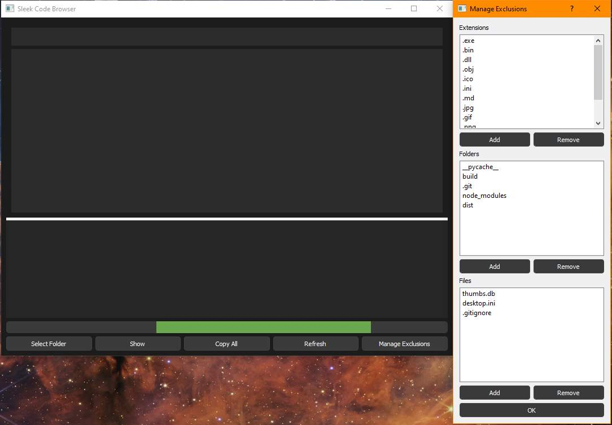

# Sleek Code Browser

## Screenshots



Sleek Code Browser is a modern, responsive tool designed to simplify the process of browsing, viewing, and copying code from your projects. With a sleek, dark-themed interface, this application makes it easy to navigate your project folders, view the content of code files, and quickly copy snippets or entire files to the clipboard.

## Features

- **Project Folder Navigation**: Quickly select your project folder and browse its contents with an intuitive tree view.
- **Automatic File Selection via Exclusions**: Files that are not excluded in the configuration are auto-selected for convenience.
- **INI-based Configuration**: Exclusions for extensions, files, and folders are managed through `settings.ini`. The file is auto-created with sensible defaults if missing.
- **Exclusion Editor**: The "Manage Exclusions" button lets you interactively edit exclusions within the app UI—no need to manually edit the ini file.
- **Auto-Refresh**: When exclusions are updated, the file list automatically refreshes to reflect changes.
- **Code Viewing**: Display the content of selected files directly within the application. Visual markers show the beginning and end of each file.
- **Easy Copying**: Copy individual file contents or all displayed content using dedicated buttons.
- **Jump Tabs**: Use tabs to quickly jump to specific files currently displayed.

## Installation

### Prerequisites

- **Python 3.x**
- **PyQt5**: Install it using pip:

```bash
pip install PyQt5
```

### Cloning the Repository

```bash
git clone https://github.com/blahpunk/sleek_code_browser.git
cd sleek_code_browser
```

## Usage

1. **Launch the Application**: Run the main file:

   ```bash
   python main.py
   ```

2. **Select Your Project Folder**: Click "Select Folder" to browse to your target directory.

3. **View & Copy Code**: Click "Show" to preview selected files. Use copy icons or "Copy All" to extract contents to clipboard.

4. **Edit Exclusions**: Click "Manage Exclusions" to add/remove excluded extensions, folders, or files.

5. **Refresh**: Use "Refresh" to manually reapply exclusions after any changes to `settings.ini`.

## Contributing

Contributions are welcome! Please submit issues or pull requests via the GitHub repository.

## License

This project is licensed under the MIT License. See the `LICENSE` file for more information.
