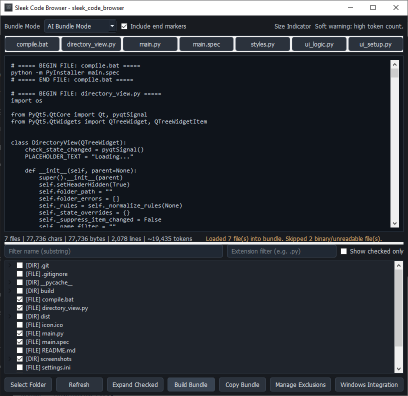

# Sleek Code Browser

Sleek Code Browser is a Windows-first desktop app for building a single prompt-ready code bundle from selected files in a project.

## Screenshot



## Features

- Project tree with checkboxes and filters (`name`, `extension`, `checked-only`).
- Smart exclusion management with presets and project-specific overrides.
- Two bundle formats:
- `AI Bundle Mode`
- `Language-Safe Mode` (comment-style markers per file type)
- Single full-bundle preview (no batching).
- File jump chips for all selected files.
- Bundle stats: `files | chars | bytes | lines | ~tokens`.
- Size indicator warnings:
- Soft warning (high token count)
- Hard warning (likely too large for one paste)
- One-click copy of the full bundle.
- Windows integration installer:
- Adds Explorer right-click menu: `Sleek Here`
- Works on folder background and folder items
- Updates user `PATH`

## Requirements

- Windows 10/11
- Python 3.10+ (for source run/build)
- PyQt5

Install dependency:

```bash
pip install PyQt5
```

## Run From Source

```bash
python main.py
```

Optional startup folder:

```bash
python main.py "C:\path\to\project"
```

## Build Executable

```bash
compile.bat
```

This runs:

```bash
python -m PyInstaller main.spec
```

Output:

- `dist/SleekCodeBrowser.exe`

## Windows Integration (In-App)

Use the `Windows Integration` button in the app to install/update or remove shell integration.

Install adds:

- `Sleek Here` on folder right-click (`HKCU\Software\Classes\Directory\shell\SleekHere`)
- `Sleek Here` on folder background right-click (`HKCU\Software\Classes\Directory\Background\shell\SleekHere`)
- App launch directory to user `PATH`

No admin rights are required (current-user scope).

## Typical Flow

1. Select a folder.
2. Check files/folders to include.
3. Click `Build Bundle`.
4. Use file chips to jump.
5. Click `Copy Bundle`.

## Repo

```bash
git clone https://github.com/blahpunk/sleek_code_browser.git
cd sleek_code_browser
```
